= Arquillian Reporter image:https://travis-ci.org/arquillian/arquillian-reporter.svg["Build Status", link="https://travis-ci.org/arquillian/arquillian-reporter"]
:toc:

Arquillian reporter brings neat and comprehensive reports into Arquillian Universe.

= For testers

If the Reporter is not provided by any extension that you are using, then to use the Arquillian Reporter in your test you just need to add this depchain dependency:

[source,xml]
----
<dependency>
    <groupId>org.arquillian.reporter</groupId>
    <artifactId>arquillian-reporter-depchain</artifactId>
    <version>${version.arquillian.reporter}</version>
    <type>pom</type>
</dependency>
----

into your pom.xml file.

== Configuration

Please put this extension definition into arquillian.xml in order to bootstrap the configuration:

<extension qualifier="reporter">
    <property ... />
</extension>

|===
|Configuration property | Description | Default value
|+rootDir+
|root directory which prepends +file+
|target
|+file+
|export report in given file
|report.json
|===

Note: If don't want to override above mentioned configuration property, then there is no need to add extension in arquillian.xml.
Reporter will take default values for properties rootDir(target) & file(report.json)

= For developers of an Arquillian extension

Arquillian reporter offers you a possibility to create complex and structured reports from your Arquillian extension in an easy and a clean way.
To use it in your Arquillian extension use the same dependency-chain that is stated above (`org.arquillian.reporter:arquillian-reporter-depchain`)

If you don't want to read about the theory and just see some examples, you can jump to the chapter <<Examples>> where are also some graphs available, or directly to the chapter <<More examples>> where are oly code snippets and its description.

== Report

The main building block is a `Report` that consist of:

* name
* list of Entries
* list of other sub-reports

As an `Entry` you can use any information that matches one of these types:

* String
* Key-value (where value is an Entry)
* File
* Link
* Table
* Graph

From the structure, you can see that it allows you to build a huge number of combinations of your report that can be transitively nested.
The best representation of the resulting report structure is a tree that consist of one root report and its sub-reports.

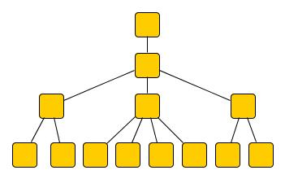

The root report is created automatically by Arquillian Reporter project and it represents the whole test execution. The content of other sub-reports depends on tools and extensions you use and you have on your classpath.

The Java class `Report` is an interface and it is not expected that you would have to provide you own implementation (but you can if you want - for more information see <<Create your own report>>). For the basic purposes (that should be sufficient for you) there is an implementation called `BasicReport` and it contains exactly the same information that is listed above. For other purposes there are also other `Report` implementations:

* `ConfigurationReport`
* `FailureReport`
* `TestSuiteReport`
* `TestClassReport`
* `TestMethodReport`

== How to use it?

To add anything to the whole report you should use events provided by Arquillian Reporter. The payload of the event is an instance of a `Report` implementation. However, before you fire your first event containing your report you should understand the structure that is internally used; and you should also know how could you use builders and other features provided by Arquillian Reporter.

== Merging & adding new reports

Arquillian Reporter provides several automatic operations to make your reporting easier and more independent. One of the operations is merging.

*Merging* +
Arquillian Reporter is able to merge two reports together so you don't have to complicatedly collect all information and then fire them at once. Instead of that, you can fire several events continuously - in other words, you can notify immediately when you have some piece of information and let Reporter merge (based on some information) the pieces together. +
Another case is when you want to add some entry to a report that has been created by other extension or by Arquillian Reporter itself. You don't have to browse through the whole tree, you just fire an event with an appropriate identifier and information will be merged.

To make the merging possible, we need to somehow identify the nodes of the whole report tree. Because of complexity, it wasn't possible to identify all the nodes in the whole tree but only some of them. The whole Report tree is divided into several sections and only the root reports of the sections are allowed to be merged. Does it seem to be complicated? Lets take a look at the definition of sections at first.

=== Section

The whole report tree is divided into several sections. There is one root section - called `ExecutionSection`. It consists of the whole tree divided into several subsections.
Every section is represented by an event class that is an implementation of the abstract class `SectionEvent`. You can create your own section (for more information see <<Create your own section>>) or you can reuse some of those that are already implemented and used.

Sections (events) that are already implemented by Arquillian Reporter:

* `TestSuiteSection`
* `TestSuiteConfigurationSection`
* `TestClassSection`
* `TestClassConfigurationSection`
* `TestMethodSection`
* `TestMethodConfigurationSection`
* `TestMethodFailureSection`

Sections implemented by Arquillian-core Reporter:

* `TestSuiteConfigurationContainerSection`
* `TestClassConfigurationDeploymentSection`

If we incorporated some of them into the report tree, it would look like this:

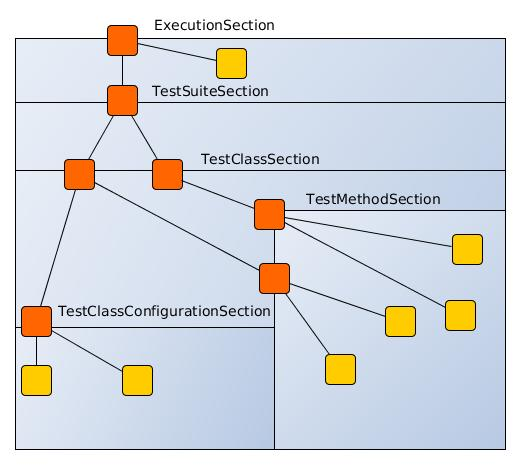

Only the red nodes (reports) are possible to merge as they are the root nodes of each section. As you can see, there can be multiple root nodes in one section so we need to identify them. For this purpose, every section event that is fired with some report payload should contain a string as an identifier. This identifier should be unique in the whole subsection.

Internally, Arquillian Reporter then needs to keep an additional tree. It is a tree that consists of `SectionEventImplementation.class + identifier` nodes. Let's call it "section tree". If we rewrote the previous tree into the section tree that is internally kept then it could look like this:

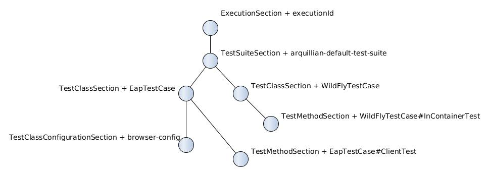

There you can see that every node in the section tree is defined by a combination of the `SectionEventImplementation.class + identifier`. These nodes then keep references to corresponding report instances in the report tree:

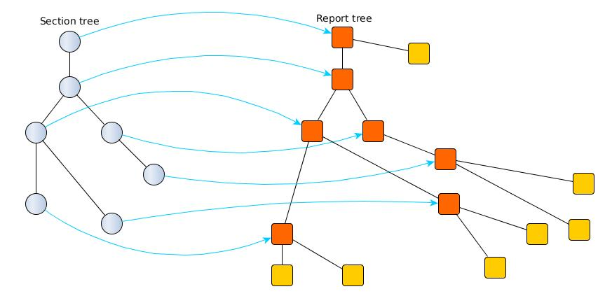

If you want to add some additional information to a configuration report related to browsers, then you just fire an event `TestClassConfigurationSection` with an identifier `browser-config` and the attached `Report` instance. Arquillian Reporter then will find the existing report and add entries and sub-reports contained in the new report to the existing one.

=== How to identify the node

In the previous section, we have described basics about sections and merging. You can certainly imagine that it can be sometimes quite difficult to match the correct report that should be merged.
Imagine this situation:

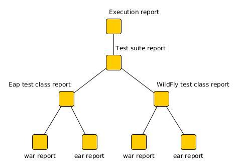

There are several deployments with the same name (identifier) but used in different test classes. So, how I can merge the report related to the `ear` deployment which was used in the `EapTestCase` class? Every section event contains also an additional information that helps us to identify a parent section the section belongs to. In other words, there in the `TestClassConfigurationDeploymentSection` class you can define the test class (and corresponding test suite identifier) the deployment was defined in. Arquillian Reporter then using method `getParentSectionThisSectionBelongsTo()` retrospectively creates an expected path in the section tree:

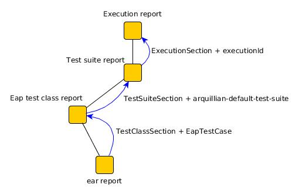

And then it tries to find the best candidate in the whole section tree. If there is already a section with the corresponding identifier in the section tree, then the reports are merged. If there isn't any, then it adds a new one and the report contained in the event attaches into report tree.

==== Missing identifier of parental sections

In case that the section event doesn't contain all necessary information to match the specific nodes in the section tree (eg. missing identifier of the test class or the test suite), then Arquillian Reporter takes the latest added node belonging to corresponding section. +
Let's take the previous example. In case we didn't specify the test class the deployment was defined in, then the expected path would look like this:

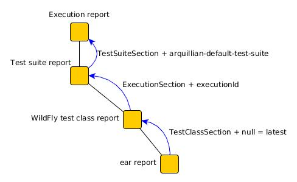

Since there wouldn't be any identifier for TestClassSection set, then the latest report would be taken => `WildFlyTestCase`

==== Automatic creation of missing section nodes

It may happen that you want to add a subsection of some section that doesn't exist. In other words, in the section event that you fire you use an identifier that doesn't match any existing section node. Arquillian Reporter then creates missing section node with the identifier and also corresponding report node in the report tree. The report's name is equal to the missing section identifier. The report that has been attached in the section event is then added in this automatically created report as its sub-report. +
This will guarantee that none of the reported information will be lost. Take a look at the chapter <<Examples>> to see the real example of this functionality.

== Builders

To make your reporting easier there are available several builders providing a fluent API that helps you to create reports, entries and add reports into appropriate sections. +
The main starting point is the class `Reporter`.

=== ReportBuilder
using this builder you can build a report. To do so, use the method:
[source,java]
----
Reporter.createReport()
----
There are three methods with this name but with a different parameter. If you use one of these methods:
[source,java]
----
Reporter.createReport(String name)
Reporter.createReport(StringKey name)
----
then `BasicReportBuilder` is used and thus an instance of `BasicReport` is created (more about `StringKey` in this chapter: <<String-keys>>). There are several more specific report-builders implemented, but all of them has the same basic set of API methods. +
To use one specific builder to create one specific report, choose the method `createReport(Report report)` where as a parameter use an existing instance of your desired report. For example, if you write:
[source,java]
----
Reporter.createReport(new TestClassReport("my report"));
----
then `TestClassReportBuilder` is used as the default builder for `TestClassReport`.

Useful report builders that are implemented by Arquillian Reporter:

* `BasicReportBuilder`
* `TestSuiteReportBuilder`
* `TestClassReportBuilder`
* `TestMethodReportBuilder`
* `ConfigurationReportBuilderImpl`
* `FailureReportBuilderImpl`

==== ReportBuilder API
Report builders provide you a fluent API that helps you to create a complex report. All methods return the same instance of the builder so you can use a fluent and compact code to be more readable. To get the final instance of the built report, call the method `build()`:
[source,java]
----
Reporter.createReport(...).....build();
----

Some other method examples (that are same for all report builders):

* To add a key-value pair entry into the set of entries:
+
[source,java]
----
Reporter.createReport(...).addKeyValueEntry(String key, String value)
----

* To add any entry
+
[source,java]
----
Reporter.createReport(...).addEntry(Entry entry)
----

* To add a sub-report
+
[source,java]
----
Reporter.createReport(...).addReport(Report report)
----
+
or instead of passing an instance of a report you can pass an instance of `ReportBuilder` without any need to build it:
+
[source,java]
----
Reporter.createReport(...)
        .addReport(Reporter.createReport(..)....)
        .build();
----

==== Add into section

Now, when you have an instance of a built report you would like to add it into the whole report tree. To do so, you should create an instance of an event that represents a section the report should belong to, set the report as a payload and then fire it. The standard code would look like:
[source,java]
----
ConfigurationReport report = Reporter
            .createReport(new ConfigurationReport("my report"))
            .build();
injectedSectionEvent.fire(new TestClassConfigurationSection(report, "configId"));
----
instead of this, you can use method `inSection` provided by `ReportBuilder` API and keep everything compact:
[source,java]
----
Reporter
    .createReport(new ConfigurationReport("my report"))
    .inSection(new TestClassConfigurationSection("configId"))
    .fire(injectedSectionEvent);
----
Reporter uses the corresponding instance of report, builds it, sets it into the provided section event and fires the event.

==== Type of the payload & add as sub-reports

As you might have already noticed, every section event has some type of `Report` defined as its default payload type. For example `TestMethodSection` has `TestMethodReport` and `TestMethodConfigurationSection` has `ConfigurationReport` etc... These types are also defined in the constructors of the section event classes. However, using the ReportBuilder API you can make the section carrying any other `Report` type. You can do for example this:
[source,java]
----
Reporter
    .createReport("my sub-report")
    .inSection(new TestClassSection(TestClass.class))
    .fire(injectedSectionEvent);
----
This creates an instance of `BasicReport` and sets it into the `TestClassSection` event. Since the default `Report` type of the section-event is `TestClassReport` then Arquillian Reporter finds the report related to `TestClass.class` and instead of merging it it adds the attached report into the list of sub-reports.

But what if the default payload is `BasicReport` and I want to add a new instance of `BasicReport` into the list of sub-report. Then, you need to use the method `asSubReport()`:
[source,java]
----
Reporter
    .createReport("my sub-report")
    .inSection(new TestSuiteConfigurationContainerSection("containerId"))
    .asSubReport()
    .fire(injectedSectionEvent);
----

=== Entry builders

==== TableBuilder

Table builder provides you a fluent API that helps you to create a complex table. To use the builder call one of the two methods:
[source,java]
----
Reporter.createTable(String name)
Reporter.createTable(StringKey name)
----
and to get an instance of the table entry use the method `build()`

== Examples

So, we went through the basics of the Arquillian Reporter functions. Now, it's time to provide some example how to add your reports to the whole report tree.

Let say that we have this initial structure of the report:

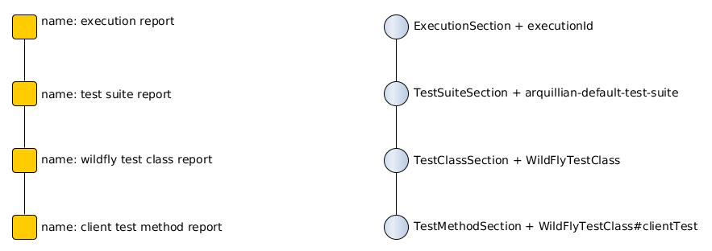

Now, we would like to add an information that both the test class and the test method are marked to be run as a client (to add key-value entry runAsClient = true)

First of all, we will add it into the test class report. Because we need to merge the reports we have to use `TestClassReport` (we can omit the name), then we can add key-value pair and fire it using a corresponding section event.
[source,java]
----
Reporter
    .createReport(new TestClassReport())
    .addKeyValueEntry("runAsClient", true)
    .inSection(new TestClassSection(WildFlyTestClass.class))
    .fire(injectedSectionEvent);
----
and analogically for test method
[source,java]
----
Reporter
    .createReport(new TestMethodReport())
    .addKeyValueEntry("runAsClient", true)
    .inSection(new TestMethodSection())
    .fire(injectedSectionEvent);
----
then the resulting tree structures would be same - only the information would change:

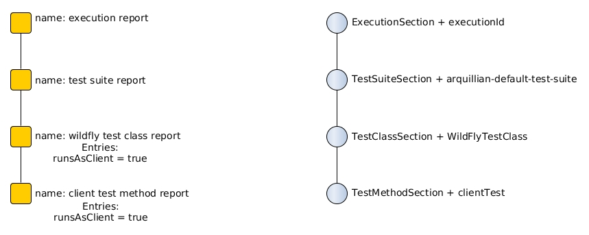

The next step is to add information about a container. There is already a section created for container related information - `TestSuiteConfigurationContainerSection` - and the default payload is `BasicReport`
[source,java]
----
Reporter
    .createReport("WildFly")
    .addKeyValueEntry("jbossHome", "/path/to/wildfly")
    .addKeyValueEntry("managed", "false")
    .inSection(new TestSuiteConfigurationContainerSection("WildFly"))
    .fire(injectedSectionEvent);
----
Using the API we've just created an instance of BasicReport with the name "WildFly" and added some key-value entries. Then we set the report as a payload of `TestSuiteConfigurationContainerSection` event and fired the event.
`TestSuiteConfigurationContainerSection` is a subsection of `TestSuiteConfigurationSection`, but there isn't any corresponding section-event-node present in the graph. In this case, the functionality described in the chapter <<Automatic creation of missing section nodes>> is used. Since `TestSuiteConfigurationContainerSection` identifies its parent in this way:
[source,java]
----
new TestSuiteConfigurationSection(testSuiteId, "containers");
----
then a new section node `TestSuiteConfigurationSection` with the identifier `"containers"` is created. The resulting trees then would like:

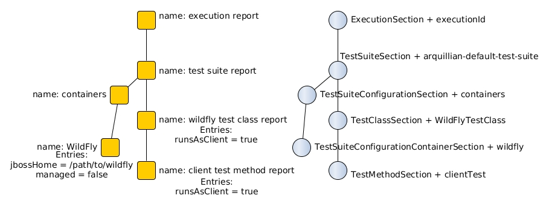

The last step is to add a new information to the `TestMethodSection` about Drone. We want to add that in this method a method-scoped instance of a drone was used and that the browser was Firefox.
[[bookmark-drone-report]]
[source,java]
----
Reporter
    .createReport("Drone report")
    .addKeyValueEntry("scope", "method")
    .addKeyValueEntry("browser", "Firefox")
    .inSection(new TestMethodSection(clientTest))
    .fire(injectedSectionEvent);
----
We just want to add a basic report to the list of sub-reports - that's why we don't need to specify any concrete report type. Then we use the `TestMethodSection` event with the defined test method. When we fired, the section tree wouldn't change. But in the report tree, there would occur a new report node:

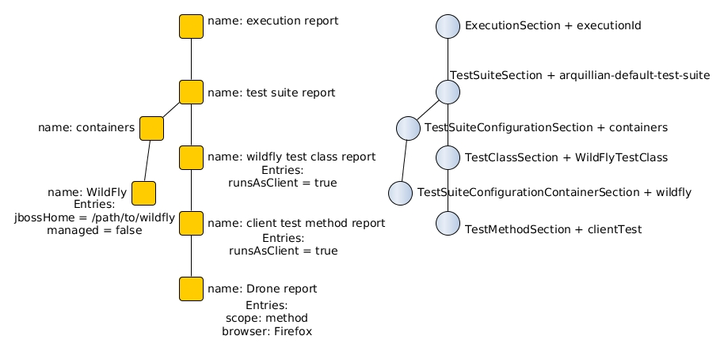

Analogically, we could continue with merging and adding new reports.

== String-keys

In all report examples, that you can see in the text above, there are used only a `String` values for defining report names and key-values. However, using a `String` is not an ideal way of using it (we used it only because of simplicity). The preferred way is using `StringKey`.

=== What is StringKey?

`StringKey` is an abstraction of most of the string values used in the whole report. It is a way that we chose for bringing additional semantic into the report. You can imagine that it could be sometimes quite difficult to figure out what some name of a report or a key-value pair stands for. Using `StringKey` we are able to add an additional description, an icon or an additional localization to the report.

`StringKey` is an interface with one default abstract implementation `AbstractStringKey` that implements all necessary methods. It is expected that every integration of Arquillian Reporter should provide its own `StringKey` implementation that (ideally) extends the `AbstractStringKey`. +
 Example: let say that we have an implementation `MyExtensionStringKey`. This class has to be registered as a service implementation of the `StringKey` interface using an Arquillian SPI:
[source,java]
----
public class MyExtension implements LoadableExtension {

    public void register(ExtensionBuilder builder) {
        builder.service(StringKey.class, MyExtensionStringKey.class);
        ...
----
`MyExtensionStringKey` class should then contain public static and final constants of the same class itself. These constants should be then used in reports. For example, let say that we have these constants defined in our `MyExtensionStringKey` class:
[source,java]
----
public class MyExtensionStringKey extends AbstractStringKey {

    public static final StringKey DRONE_REPORT = new MyExtensionStringKey();
    public static final StringKey DRONE_SCOPE_IN_GENERAL = new MyExtensionStringKey();
    public static final StringKey DRONE_BROWSER = new MyExtensionStringKey();
}
----
If we used our string-keys, then <<bookmark-drone-report,this code snippet>> would look like this:
[source,java]
----
Reporter
    .createReport(DRONE_REPORT)
    .addKeyValueEntry(DRONE_SCOPE_IN_GENERAL, "method")
    .addKeyValueEntry(DRONE_BROWSER, "Firefox")
    .inSection(new TestMethodSection(clientTest))
    .fire(injectedSectionEvent);
----

=== StringKey property file

Now, how to add the string value, description and other values? For this purpose, there is one property file used. The file:

* should be located in `src/main/resources` directory
* should have a name that is same as the fully qualified name of the `StringKey` implementation (with the suffix `.properties`). So, in our case: `org.arquillian.my.extension.reporter.MyExtensionStringKey.properties`
* should contain properties for all constants defined in the `StringKey` implementation with additional suffixes (all of them are optional):
    ** `.value` for the actual value of the `StringKey` itself
    ** `.description` for additional information about the the value/report
    ** `.icon` the path to an icon that should be used in the resulting report

In our case, the file would be:

.org.arquillian.my.extension.reporter.MyExtensionStringKey.properties
----
DRONE_REPORT.value=Drone report
DRONE_REPORT.description=Report containing information about Drone instance used in the test
DRONE_REPORT.icon=./path/to/drone.icon

DRONE_REPORT.value=Scope
DRONE_SCOPE_IN_GENERAL.description=Scope of the drone instance
...
----
Arquillian Reporter finds these files, parses it, gets the values and assign them into the constants. The values are then available in the resulting report.

=== UnknownStringKey

Although `StringKey` is a preferred way of setting names and keys, it is still possible to use a pure `String` value. In this case, the String is automatically wrapped into an instance of `UnknownStringKey` class.

== Create your own report

If you feel to be limited by the provided set of `Report` implementations, then you can create your own. As a report is considered any class that implements `Report` interface. There is provided an abstract implementation that implements the basic functionality - `AbstractReport` - so it is advised to extend this class.

Every `Report` implementation class has two parameters:

1. the `Report` implementation type itself
2. a report builder that should be used in case of Reporter fluent API. If you don't want to create your own builder, then you can specify `ReportBuilder` and the basic implementation will be used.

Let say that we want to create `MyReport` then the class declaration would be:
[source,java]
----
public class MyReport extends AbstractReport<MyReport, ReportBuilder> {
...
}
----

== Create your own Builder

If you feel to be limited by the provided set of `Builder` implementations, then you can create your own. As a builder is considered any implementation of an interface `Builder`. If you implement this interface, then you can use a method:
[source,java]
----
Reporter
    .usingBuilder(MyBuilder.class, toBuild)
    ....
----
with your builder class and constructor parameters.

The `Builder` interface itself doesn't have any parameter nor require implementing any method.

=== Create your own ReportBuilder

If you want to create a new `Builder` for building reports, then you should implement a sub-interface `ReportBuilder` that has several methods and 2 parameters. There is provided an abstract implementation that implements the methods and it is very advised to extend it: `AbstractReportBuilder`.

The parameters of the `ReportBuilder` are:

1. the `ReportBuilder` implementation type itself
2. the `Report` type the builder should be used for

Let say that we want to create a builder `MyReportBuilder` for `MyReport` report:
[source,java]
----
public interface MyReportBuilder extends ReportBuilder<MyReportBuilder, MyReport> {
...
    public void sayHelloWorld();
}
----
and the `MyReport` class would be changed to:
[source,java]
----
public class MyReport extends AbstractReport<MyReport, MyReportBuilder> {
...
}
----
Then, If we used the Reporter API, I would be able to call:
[source,java]
----
Reporter
    .createReport(new MyReport())
    .sayHelloWorld()
    ...
----

=== Register implementation of Builders

If you want to keep interfaces and their implementations separated, then you need to register them. For this purpose you should use an Arquillian SPI:
[source,java]
----
public class MyExtension implements LoadableExtension {

    public void register(ExtensionBuilder builder) {
        builder.service(MyReportBuilder.class, MyReportBuilderImpl.class);
        ...
----

== Create your own section

If you need to create a new report section, then you have to extend the abstract class `SectionEvent`. This abstract class has 3 parameters:

1. the `SectionEvent` implementation type itself
2. a `Report` type that is the default payload type of the event
3. a `SectionEvent` type representing a section that is parental section of the new section

Let say that we want to create `MySection` that is subsection of `TestMethodSection` and the payload is `MyReport`:
[source,java]
----
public class MySection extends SectionEvent<MySection, MyReport, TestMethodSection> {
    ...
}
----

== More examples

====
*I.*

Add a new configuration report related to a test suite with an id `"test-suite-id"`. This report should contain a key-value pair:
[source,java]
----
Reporter
    .createReport(new ConfigurationReport("My config report name")) // <1>
    .addKeyValueEntry("this is a key", "this is a value") // <2>
    .inSection(new TestSuiteConfigurationSection("my-config-id", "test-suite-id")) // <3>
    .fire(injectedSectionEvent); // <4>
----
<1> The type of the `Report` has to be a `ConfigurationReport` because it is the default payload of the `TestSuiteConfigurationSection` event and we want to create a completely new report.
<2> Add the key-value pair
<3> Set it into the appropriate section `TestSuiteConfigurationSection` (config section under a test suite section) where is specified the configuration id `"my-config-id"` and `"test-suite-id"` as an id of the test suite the configuration relates to
<4> Fire the event using an injected instance of `Event<SectionEvent>`.
====

{empty} +

====
*II.*

Add an additional sub-report to the configuration report that we created in the previous step - there are three ways of doing so - first one: +
[source,java]
----
Reporter
    .createReport(new ConfigurationReport()) // <1>
    .addReport(Reporter // <2>
                   .createReport("My config sub-report name")
                   .add... // <3>
                   ...
    .inSection(new TestSuiteConfigurationSection("my-config-id")) // <4>
    .fire(injectedSectionEvent);
----
<1> Create a `ConfigurationReport` that will be merged with the one from previous step. The name is not necessary, as the original name `"My config report name"` is taken and won't be overridden.
<2> Add the report you want to append as a sub-report of this new configuration report
<3> Add anything you want into the report
<4> Set it into the appropriate section `TestSuiteConfigurationSection` with an id of the configuration we want to merge: `"my-config-id"`. There isn't specified the id of the test suite - we know, that the report is part of the latest test suite report, so we don't have to add there the id as it will match the latest one.

The second way is shorter and preferred. The result is completely same:
[source,java]
----
Reporter
    .createReport("My config sub-report name") // <1>
    .add... // <2>
    ...
    .inSection(new TestSuiteConfigurationSection("my-config-id")) // <3>
    .fire(injectedSectionEvent);
----
<1> Create a `BasicReport`
<2> Add anything you want into the report
<3> this is same as the previous one - set it into the section `TestSuiteConfigurationSection` with an appropriate id `"my-config-id"`; id of the test suite is not necessary - the latest one is used.

As the payload is a `BasicReport` and not a `ConfigurationReport` then Arquillian Reporter automatically takes this basic one and wraps into an instance of `ConfigurationReport`. The result is same but using less code.

The third way is just defining that the `Report` should be added as a sub-report:
[source,java]
----
Reporter
    .createReport("My config sub-report name")
    .add...
    ...
    .inSection(new TestSuiteConfigurationSection("my-config-id"))
    .asSubReport() // <1>
    .fire(injectedSectionEvent);
----
<1> Specify that the report should be attached into the list of sub-reports
====

{empty} +

====
*III.*

Add a new configuration report containing a string entry to the latest test suite report:
[source,java]
----
Reporter
    .createReport(new ConfigurationReport("Second config report name")) // <1>
    .addEntry("this is a string entry") // <2>
    .inSection(new TestSuiteConfigurationSection("my-second-config-id")) // <3>
    .fire(injectedSectionEvent); // <4>
----
<1> Create a `ConfigurationReport`
<2> Add a string entry (or anything you want)
<3> Set in the appropriate section with a configuration id specified. Id cannot be same as we want to create a new configuration report
<4> Fire
====

{empty} +

====
*IV.*

Add a table entry and key-value pair into the configuration report `"Second config report name"` from the previous step
[source,java]
----
TableEntry myTable = Reporter // <1>
                        .createTable("My table") // <2>
                        .addBodyRow("first row first column", "first row second column") // <3>
                        .addBodyRow("second row first column", "second row second column") // <4>
                        .build(); // <5>

Reporter
    .createReport(new ConfigurationReport()) // <6>
    .addEntry(myTable) // <7>
    .addKeyValueEntry("this is a key", "this is a value") // <8>
    .inSection(new TestSuiteConfigurationSection("my-second-config-id")) // <9>
    .fire(injectedSectionEvent); // <10>
----
<1> Use the `Reporter` class also for creating a table
<2> Create table with a name
<3> Add a first row containing two cells into the body
<4> Add a second row containing two cells into the body
<5> Build and get the resulting table.
<6> Create a configuration report - needs to be merged because of the entries (the name is not necessary)
<7> Add the created table entry
<8> Add key-value pair entry
<9> Set the report into an appropriate section with corresponding id
<10> Fire
====

{empty} +

====
*V.*

Add a sub-report containing key-value pairs created from a map of strings to the latest test method report:
[source,java]
----
Map<String, String> mapOfStrings = ...;
Reporter
    .createReport("Sub-report of method report") // <1>
    .feedKeyValueListFromMap(mapOfStrings) // <2>
    .inSection(new TestMethodSection()) // <3>
    .fire(injectedSectionEvent);
----
<1> We're adding a report to an existing one - instance of a `BasicReport` is enough.
<2> Using method `feedKeyValueListFromMap` you can pass a map of strings and Reporter creates for every pair of key and value a key-value entry.
<3> We want to add it into the latest test method report => we use `TestMethodSection` and no identifier is necessary.
====

{empty} +

====
*VI.*

Add a sub-report containing two string entries to a test method report of the method `myTestMethod` (it is part of the latest test suite).
[source,java]
----
Reporter
    .createReport("Sub-report of myTestMethod report")
    .addEntry("first string entry")
    .addEntry("second string entry")
    .inSection(new TestMethodSection(myTestMethod))
    .fire(injectedSectionEvent);
----
====

{empty} +

====
*VII.*

Add a key-value entry and a sub-report containing a string entry to a test class report of the class `DummyTestClass.java` (it is part of the latest test suite).
[source,java]
----
Reporter
    .createReport(new TestClassReport()) // <1>
    .addKeyValueEntry("this is key", "this is value") // <2>
    .addReport(Reporter  // <3>
                   .createReport("sub-report")
                   .addEntry("string entry"))
    .inSection(new TestClassSection(DummyTestClass.class)) // <4>
    .fire(injectedSectionEvent);
----
<1> Create a `TestClassReport` as we need to merge it - because of the key-value entry.
<2> Add key-value entry
<3> Add sub-report with the string entry
<4> Set it into the `TestClassSection` with the class specified
====

{empty} +

====
*VIII.*

Add a configuration report to the test class report of `DummyTestClass.java` class
[source,java]
----
Reporter
    .createReport(new ConfigurationReport("Config of DummyTestClass"))
    .add...
    ...
    .inSection(new TestClassConfigurationSection("my-dummy-config-id", DummyTestClass.class)) // <1>
    .fire(injectedSectionEvent);
----
<1> We're using the the `TestClassConfigurationSection` where the first parameter is id of the configuration and the second one is a class the report belongs to.
====

{empty} +

====
*IX.*

In this example we will use the code from the chapter <<Create your own section>>. We will add a report `MyReport` containing a table entry and fire it using the `MySection` (that is subsection of `TestMethodSection`). This should belong to the test method report of the method `myTestMethod`.
[source,java]
----
Reporter
    .createReport(new MyReport("My report name")) // <1>
    .addEntry(tableEntry) // <2>
    .inSection(new MySection("my-report-id", myTestMethod)) // <3>
    .fire(injectedSectionEvent);
----
<1> Create `MyReport` as we want to create a new report
<2> Add table entry (and/or anything you want)
<3> Set it into the section `MySection` that is a subsection of `TestMethodSection`. First param is an id that we can reference, second is the method this report belongs to.
====

{empty} +

====
*IX.*

Add sub-report to the `MyReport` from the previous example:
[source,java]
----
Reporter
    .createReport("My sub-report")
    .add...
    ...
    .inSection(new MySection("my-report-id", myTestMethod))
    .fire(injectedSectionEvent);
----
====